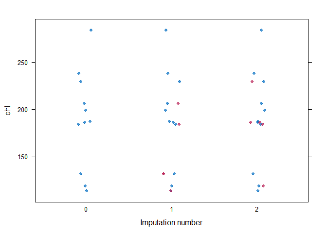
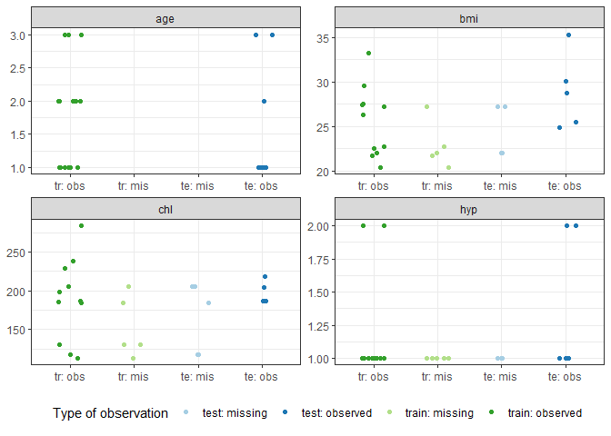
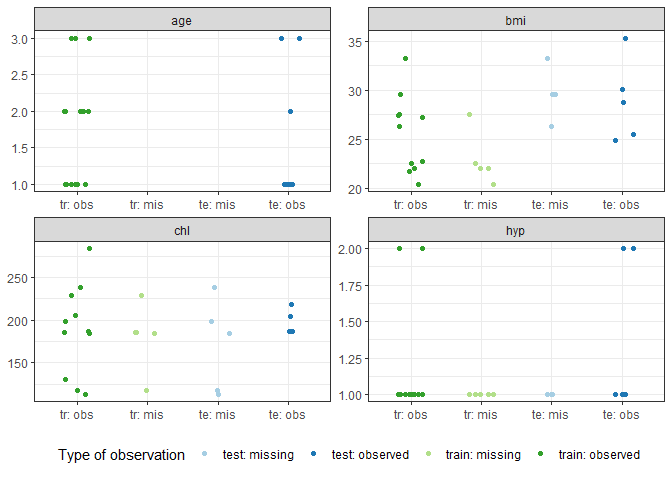

mice.reuse
================
Patrick Rockenschaub
20/03/2020

Multivariate imputation by chained equations (MICE) is a powerful way to
obtain reliable imputation estimates for datasets that contain missing
data.

The beauty of MICE as opposed to other imputation techniques such as
mean imputation, missing indicators, or single imputation is that it
propagates the uncertainty that surround your imputations. That is, even
when using a model our imputations will always ever be a *best guess*
with at least some remaining uncertainty left. Since we did not actually
observe the data, our guess will almost never be quite as good as if we
had actually observed the value, because it is almost certain that our
imputation model wasn’t able to magically divine the underlying value in
each case.

MICE represents this uncertainty by creating more than one imputed
datasets by randomly drawing from our imputation model. For example, if
you use a linear regression ") to impute a variable
 the regression line  is our best guess. However, there is both sampling
variance in the fitted  as well as residual, unexplained variance
 around our regression line. MICE takes those uncertainties
into accound by randomly drawing multiple samples that reflect that
uncertainty.

A great introduction to MICE (definitely much better than I could ever
give) can be found [here](https://stefvanbuuren.name/fimd/) by curtesy
of Stef van Burren, the creator of the widely used R package *mice*,
with comprehensive examples on why and how to perform multiple
imputation.

In the document here, we will focus on a specific operation linked to a
setting where we have split our data into a training and test set. A
setup like this is common in predictive modelling, where we want to
train a model on one part of the data and use the rest to evaluate how
well we have done.

## Problem: impute a test set in a training/test split

We focus on the simple case in which we randomly split the data once
before analysis into a training portion of the data and a test portion.
As a general rule, all estimation should exclusively be performed in the
training data and the test data should be reserved solely for testing.

In the case of multiple imputation, this means that only the training
data should influence the imputation model. We then want to use this
imputation model to also impute the data in the test set, **without
changing the imputation model** and “leaking” information that wasn’t
available during training.

This functionality is currently not readily available in *mice*.
Whenever new imputations are created in *mice* via the functions
`mice()` or `mice.mids()`, we can nly either impute training and test
together (which we do not want\!) or impute training and test separately
(which is problematic if the test set is small or if we would like to
use the model prospectively, e.g. to impute the values of a single new
observation in real-time when the model is deployed). A discussion of
how one might get around this limitation and reuse a previously trained
`mids` object to impute new data is discussed
[here](https://github.com/stefvanbuuren/mice/issues/32), with a
potentially solution outlined by Stef.

## Example data

For this example we will use the well-known `nhanes` dataset, which is
also used in the official vignettes of *mice*
(<https://stefvanbuuren.name/mice/>).

``` r
library(mice)
library(tidyverse)
library(ggplot2)

# Make sure to store `mice.reuse.R` in the same directory or change path
source("mice.reuse.R")
```

``` r
data(nhanes)
head(nhanes)
```

    ##   age  bmi hyp chl
    ## 1   1   NA  NA  NA
    ## 2   2 22.7   1 187
    ## 3   1   NA   1 187
    ## 4   3   NA  NA  NA
    ## 5   1 20.4   1 113
    ## 6   3   NA  NA 184

# Create a train/test split

In line with usual practice, we create a 2/1 training/test split of the
full dataset. We will use the `train` object to estimate the imputation
set, which we then use to draw `imputations` for both the trainig and
test data.

``` r
set.seed(1234)
size_train <- floor(nrow(nhanes) * 2 / 3)
idx <- sample(seq_len(nrow(nhanes)), size = size_train)

train <- nhanes[idx, ]
test <- nhanes[-idx, ]

print(paste("Train:", nrow(train), "observations"))
```

    ## [1] "Train: 16 observations"

``` r
print(paste("Test:", nrow(test), "observations"))
```

    ## [1] "Test: 9 observations"

## Train the imputation model

We simply use the `mice()` function to create imputations on the
training set, in line with the minimal example described
[here](https://stefvanbuuren.name/mice/).

``` r
# Impute the train portion of the data as shown in the vignettes
# https://stefvanbuuren.name/mice/
imp.train <- mice(train, maxit = 5, m = 2, seed = 1)
```

    ## 
    ##  iter imp variable
    ##   1   1  bmi  hyp  chl
    ##   1   2  bmi  hyp  chl
    ##   2   1  bmi  hyp  chl
    ##   2   2  bmi  hyp  chl
    ##   3   1  bmi  hyp  chl
    ##   3   2  bmi  hyp  chl
    ##   4   1  bmi  hyp  chl
    ##   4   2  bmi  hyp  chl
    ##   5   1  bmi  hyp  chl
    ##   5   2  bmi  hyp  chl

``` r
imp.train
```

    ## Class: mids
    ## Number of multiple imputations:  2 
    ## Imputation methods:
    ##   age   bmi   hyp   chl 
    ##    "" "pmm" "pmm" "pmm" 
    ## PredictorMatrix:
    ##     age bmi hyp chl
    ## age   0   1   1   1
    ## bmi   1   0   1   1
    ## hyp   1   1   0   1
    ## chl   1   1   1   0

As usuall, it is good practice to investigate the performance and
convergance of the imputation procedure on the training data, e.g. by
creating a strip plot. We will omit a detailed examination of the
imputations in this vignette for brevity, and simply assume that the
imputations were successful. See [this
vignette](https://www.gerkovink.com/miceVignettes/Convergence_pooling/Convergence_and_pooling.html)
for more information on imputation diagnostics that can help you decided
whether your imputations are adequate.

``` r
# Perform diagnostics as usual
stripplot(imp.train, chl, pch = 19, xlab = "Imputation number")
```

<!-- -->

## Predict for the test set

We now want to impute all missing values in the test set *without*
changing the imputation model. We will use the custom function
`mice.reuse()` provided in the accompanying script mice.reuse.R.

The function performs the following steps:

1.  Fill in the last set of imputations for the training data
2.  Initialize the missing data in the test set by random draws from
    observed values in the newdata (this is the default when `mice()` is
    called. Alternatively these could be initialised with values from
    training + test set, particularly if the test set is only one
    observation.
3.  Mark all values in the test data as missing to ensur that they are
    ingored by the `mice.impute.xxx()` imputation procedure. Put
    differently, we ask mice to draw imputations *for every single
    value* in the test data.
4.  Before the first round of imputations and after each single
    imputation (i.e. call to `mice:::sampler.univ()`), replace the
    unnecessary imputations of observed values with the acutally
    observed values. This is done via the [post-processing
    functionality](https://www.gerkovink.com/miceVignettes/Passive_Post_processing/Passive_imputation_post_processing.html)
    of *mice*
5.  Run the imputation for multiple iterations so that the
    initializations created in step 2. converge

**Note:** The result of `mice.reuse()` are a list of imputations for the
test set (as would be obtained by calling `complete(., "all")`) rather
than a new/changed mids object. This was chosen to avoid confusion,
since we only aim to create imputations and are not further interested
in the imputation model.

``` r
imp.test <- mice.reuse(imp.train, test, maxit = 1)
```

    ## 
    ##  iter imp variable
    ##   6   1  bmi  hyp  chl
    ##   6   2  bmi  hyp  chl

### Missing data in the test set

``` r
head(test)
```

    ##    age  bmi hyp chl
    ## 1    1   NA  NA  NA
    ## 3    1   NA   1 187
    ## 8    1 30.1   1 187
    ## 11   1   NA  NA  NA
    ## 14   2 28.7   2 204
    ## 19   1 35.3   1 218

### Imputed values

``` r
head(imp.test[[1]])
```

    ##    age  bmi hyp chl
    ## 1    1 22.0   1 118
    ## 3    1 27.2   1 187
    ## 8    1 30.1   1 187
    ## 11   1 22.0   1 118
    ## 14   2 28.7   2 204
    ## 19   1 35.3   1 218

(showing only the first imputation set)

## Does it work?

The default procedure for numeric data in *mice* is predictive mean
matching (PMM), which has also been used in this example. Briefly, in
PMM we predict a likely value for the missing variable and then chose
randomly among the 
closest observed values, usually called “donors” (a detailed description
of PMM can be found
[here](https://stefvanbuuren.name/fimd/sec-pmm.html)).

> If our method for correctly imputing the test set is working, we would
> expect missing values in the test set to only be imputed with values
> from the training set (because it is only allowed to use donors from
> the training data).

Below are a number of helper functions that help us plot both the
training and the test set for each variable and colour those values that
were observed and missing (=imputed).

``` r
to_long_and_add_observed <- function(data, observed){
  # Bring all variables across imputations into long format and add the 
  # true values from the observed data.
  #
  # Parameters
  # ----------
  #  data : list of data.frames
  #    the result of a call to mice::complete(., "all) or 
  #    mice.reuse(.)$data
  #  observed : data.frame
  #    the actually observed data, still including missing values
  #
  # Returns
  # -------
  #   data.frame 
  #     long format with columns m (imputation cycle), key (variable name),
  #     value (values after imputation), true (values before imputation)
  
  data %>% 
    map(gather) %>% 
    map_df(mutate, true = gather(observed)$value, .id = "m")
}
```

``` r
# Get the training data in long format (from the mids object)
res_train <- imp.train %>% 
  complete("all") %>% 
  to_long_and_add_observed(train) %>% 
  mutate(split = "train")

# Get the test data in long format (directly from mice.reuse())
res_test <- imp.test %>% 
  to_long_and_add_observed(test) %>% 
  mutate(split = "test")

# Plot 
plt_data <- rbind(res_train, res_test) %>% 
  mutate(type = paste0(split, ": ", ifelse(is.na(true), "missing", "observed")))
```

``` r
g <- 
  ggplot(NULL, aes(type, value, colour = type)) + 
  geom_point(position = position_jitterdodge()) + 
  scale_x_discrete(limits = c("train: observed",
                              "train: missing",
                              "test: missing", 
                              "test: observed"),
                   labels = c("tr: obs", "tr: mis", "te: mis", "te: obs")) + 
  scale_colour_brewer("Type of observation", palette = "Paired") + 
  facet_wrap(~ key, scales = "free") + 
  theme_bw() + 
  theme(legend.position = "bottom", 
        axis.title = element_blank())
```

### Plots

When we look a the plots, we can see that the imputations in the test
set (light blue) only take values from the training set (dark green), as
we expected.

``` r
g %+% (plt_data %>% filter(m == 1))
```

<!-- -->

``` r
g %+% (plt_data %>% filter(m == 2))
```

<!-- -->

While this quick (and dirty) check seemed successful, it might be a good
idea to perform additional investigations to ensure nothing unexpected
happens. I will try to do so over the next couple of weeks and will
update this section

## Caveats

I have only tested the above procedure for univariate imputation. Things
might break in unexpected ways if blocks with multiple variables are
used. Use at your own peril (and please definitely sense check your
results\!).
